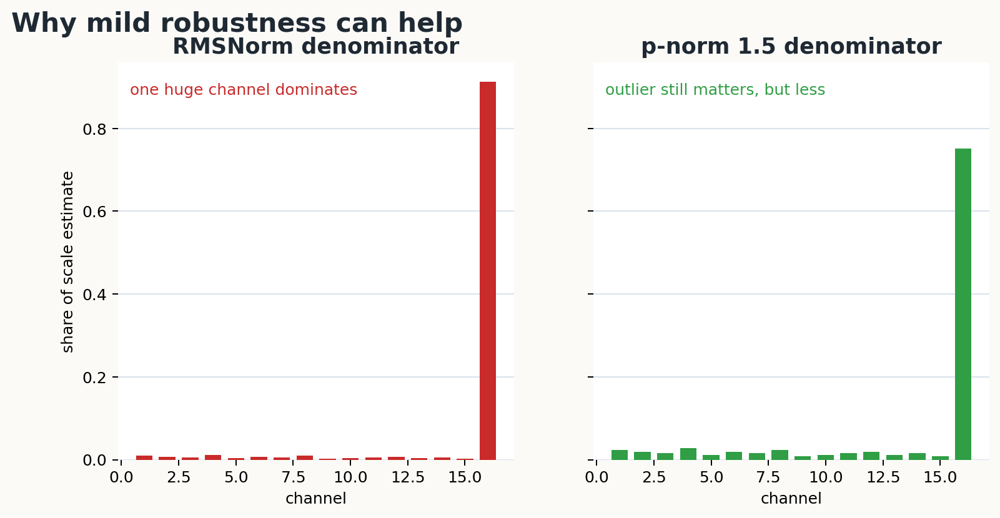
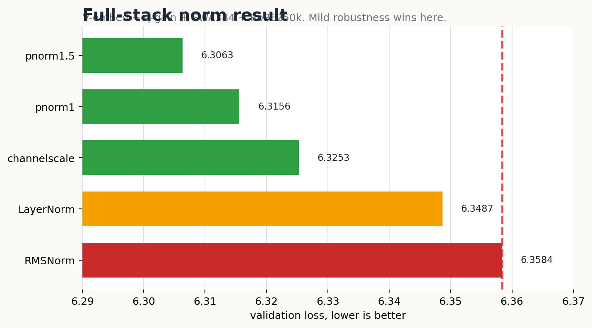
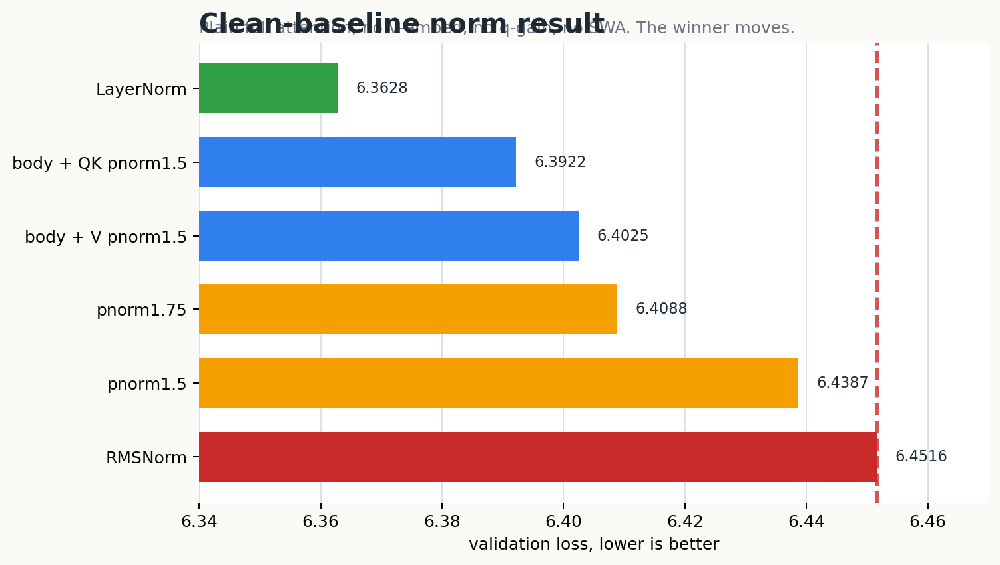
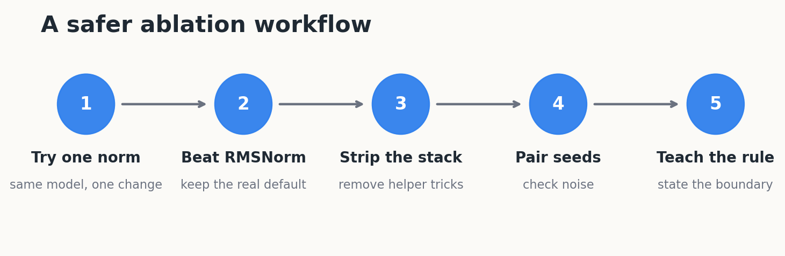

# Normalization: How To Test A Better RMSNorm

This tutorial teaches one small research habit:

**A normalization trick is only useful if it survives a fair baseline.**

We found several norms that beat `RMSNorm` on tiny transformers, but the winner
changed when we stripped the architecture down. That is the real lesson.

By the end, you should be able to:

- explain why outlier channels can make `RMSNorm` too aggressive
- add a new norm to this repo
- run it in both a rich stack and a clean baseline
- avoid claiming a lucky one-stack result as a general discovery

Supporting notes:

- [`ablations.md`](ablations.md) is the compact result table.
- [`findings.md`](findings.md) is the raw research log.
- Machine-readable metrics live in [`../../../results/tiny1m_0604`](../../../results/tiny1m_0604).

## Step 1: Start With The Simplest Picture

A transformer residual stream is a vector.

For one token, imagine the hidden state is:

```text
x = [0.8, -0.7, 0.6, -0.9, ..., 8.0]
```

Most channels are small.
One channel is huge.

That huge channel is not necessarily a bug. In real transformers, some channels
become "massive activations" that behave like learned biases. They can carry
useful information.

The problem is what happens when the norm uses that huge channel to scale the
whole vector.



`RMSNorm` uses an L2-style denominator:

```text
denom = sqrt(mean(x^2))
```

Squaring makes the huge channel dominate the denominator.
Then every other channel gets divided down too hard.

A milder p-norm, like `pnorm1.5`, still divides by a real magnitude, but it is
less dominated by the single largest channel:

```text
denom = mean(abs(x)^1.5)^(1 / 1.5)
```

The idea is not to delete the outlier.
The idea is to stop the outlier from controlling the entire scale estimate.

## Step 2: Define The Norms We Tested

All of these norms are nearly parameter-free.
Most have the same learnable per-channel gain `weight`.

The important family is:

```text
pnorm_p(x) = x / mean(abs(x)^p)^(1 / p)
```

Special cases:

| norm | p or formula | intuition |
|---|---:|---|
| `pnorm1` | `p = 1` | robust, mean absolute value |
| `pnorm1.5` | `p = 1.5` | middle ground |
| `RMSNorm` | `p = 2` | standard L2-style scale |
| `pnorm3` | `p = 3` | more sensitive to large channels |

We also tried:

| norm | idea |
|---|---|
| `LayerNorm` | subtract mean, divide by standard deviation |
| `channelscale` | learn a pre-scale before RMSNorm |
| `median` | divide by median absolute activation |
| `peak` | divide by max absolute activation |
| `squash` | use `tanh` without a divide-by-magnitude step |
| `center` | subtract mean without dividing by magnitude |

The failures matter as much as the wins.
They tell us the rule is not "be maximally robust."

The rule is:

```text
divide by a smooth all-channel magnitude,
but do not let one huge channel dominate it.
```

## Step 3: Compare In The Rich Stack

First we tested the norm inside the current tiny1m recipe:

```text
value embeddings + q-gain + SWA384 + RoPE250k
```

This is the rich stack.
It asks:

```text
If we keep the rest of the recipe fixed,
which normalization works best?
```



The full-stack result was clear:

| norm | val_loss | read |
|---|---:|---|
| `pnorm1.5` | `6.3063` | best |
| `pnorm1` | `6.3156` | strong |
| `channelscale` | `6.3253` | strong |
| `LayerNorm` | `6.3487` | around baseline |
| `RMSNorm` | `6.3584` | baseline |

This is a real result, but it is not the whole story.

The rich stack contains several other helpful changes.
So the norm might be winning because it fits that recipe, not because it is a
universal replacement for `RMSNorm`.

That is why the next step matters.

## Step 4: Strip The Architecture Down

The clean baseline removes the helper tricks:

```text
no value embedding
no q-gain
no sliding-window attention
plain full attention
default RoPE
```

This asks a different question:

```text
If the transformer is plain,
which norm still wins?
```



The answer changed:

| norm / placement | val_loss | read |
|---|---:|---|
| `LayerNorm` | `6.3628` | best clean-baseline run |
| body + QK `pnorm1.5` | `6.3922` | attention placement helps |
| body + V `pnorm1.5` | `6.4025` | value placement helps |
| `pnorm1.75` | `6.4088` | best plain p-norm |
| `pnorm1.5` | `6.4387` | beats RMSNorm, but not best here |
| `RMSNorm` | `6.4516` | clean baseline |

This is the key teaching moment.

`pnorm1.5` was best in the rich stack.
It still beat `RMSNorm` in the clean baseline.
But it was no longer the winner.

On the plain transformer, centering helped: `LayerNorm` won.
The best plain p-norm also moved from `p = 1.5` to `p = 1.75`.

So the claim should not be:

```text
pnorm1.5 is always better than RMSNorm.
```

The better claim is:

```text
RMSNorm is not sacred.
Mildly robust norms can help.
The best norm depends on the surrounding architecture.
```

## Step 5: Add A New Norm In Code

The code path is intentionally small.

Open [`../../../models/layers.py`](../../../models/layers.py).

The norm factory is:

```python
def make_norm(dim: int, norm_type: str = "rmsnorm", use_layernorm: bool = False):
    nt = (norm_type or "rmsnorm").lower()
    if nt.startswith("pnorm"):
        ...
    if nt.startswith("clipnorm"):
        ...
    if nt in _NORM_REGISTRY:
        return _NORM_REGISTRY[nt](dim)
    if nt == "layernorm" or use_layernorm:
        return nn.LayerNorm(dim, elementwise_affine=True)
    return nn.RMSNorm(dim)
```

To add a norm, write a small `nn.Module`.

Here is a minimal example:

```python
class CenteredL1Norm(nn.Module):
    def __init__(self, dim: int, eps: float = 1e-6):
        super().__init__()
        self.weight = nn.Parameter(torch.ones(dim))
        self.eps = eps

    def forward(self, x):
        xc = x - x.mean(dim=-1, keepdim=True)
        denom = xc.abs().mean(dim=-1, keepdim=True) + self.eps
        return self.weight * (xc / denom)
```

Then register it:

```python
_NORM_REGISTRY = {
    "centeredl1": CenteredL1Norm,
}
```

Now the CLI can call it:

```bash
python train_llm.py --config tiny1m --norm_type centeredl1
```

Three knobs matter:

| CLI flag | where it applies |
|---|---|
| `--norm_type` | residual stream norm |
| `--qk_norm_type` | Q and K before attention logits |
| `--v_norm_type` | V before value aggregation |

That placement distinction is important.
In the clean baseline, putting `pnorm1.5` on QK or V looked more promising than
using body-only `pnorm1.5`.

## Step 6: Run The Fair Test

The safe workflow is:



Start with the rich stack.

Then repeat the winner in a stripped baseline.

Then repeat the strongest candidates on another seed.

In this repo, the relevant queue scripts are:

```text
scripts/queue_tiny1m_norm4.sh
scripts/queue_tiny1m_norm5.sh
scripts/queue_tiny1m_norm6.sh
```

For one local smoke-style run, the command shape is:

```bash
python train_llm.py \
  --config tiny1m \
  --norm_type pnorm1.5 \
  --output_dir runs/my_norm_test
```

For a clean-baseline-style run, remove the helper architecture flags and compare
directly against `RMSNorm` and `LayerNorm`.

Do not promote a norm because it won once.
Promote it when the table tells a stable story.

## Step 7: Read Failures Correctly

The failures gave us the most useful boundary:

| failed idea | what happened | lesson |
|---|---|---|
| `center` | diverged / NaN | centering alone is not normalization |
| `squash` | diverged | a bounded nonlinearity did not replace scale control |
| `median` | much worse | too much robustness loses useful scale |
| `peak` | weak | one channel is not enough information |
| `clipnorm3` | no real gain | outliers are functional, not pure noise |

This is why the result is subtle.

Outlier channels are not trash.
They are part of the learned representation.

A good norm should reduce their ability to dominate the denominator while still
letting them participate in the vector.

## Step 8: What We Actually Learned

The clean lesson is:

```text
RMSNorm is a strong convention, not a law.
Mild robustness can improve small transformers.
The best norm is stack-dependent.
```

Current evidence:

| setting | strongest read |
|---|---|
| rich stack | `pnorm1.5` was best |
| clean baseline | `LayerNorm` was best |
| clean p-norm sweep | `pnorm1.75` was the best plain p-norm |
| latest partial seed | `channelscale` is a promising lead, not confirmed |

That is a better tutorial than a single winner.

It teaches how to avoid fooling yourself.

## Tiny Hand Check

Suppose you test a new norm and get:

| setting | your norm | RMSNorm |
|---|---:|---:|
| rich stack | 6.31 | 6.36 |
| clean baseline | 6.47 | 6.45 |

What should you claim?

Answer:

```text
The norm helps in the rich stack, but it does not generalize to the clean
baseline yet. It is a contextual result, not a replacement for RMSNorm.
```

That answer is less flashy, but it is more useful.

## Done Checklist

- You can explain why L2 scale can be dominated by a few large channels.
- You can describe why `pnorm1.5` helped in the rich stack.
- You can explain why the clean baseline changed the winner.
- You know where to add a norm in [`../../../models/layers.py`](../../../models/layers.py).
- You know which CLI flags control body, QK, and V normalization.
- You know not to claim a universal result from one seed or one stack.
