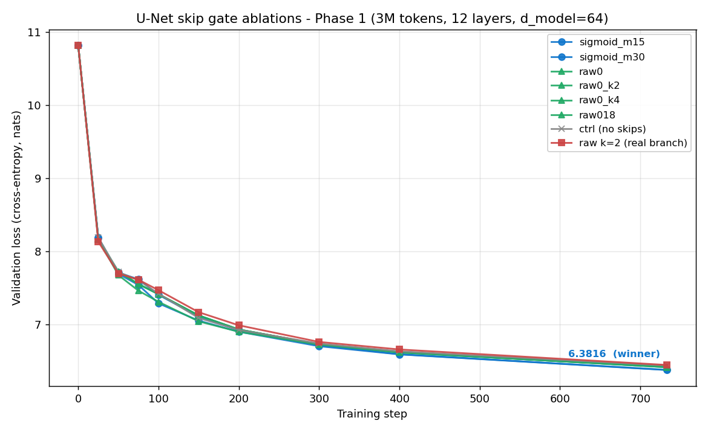
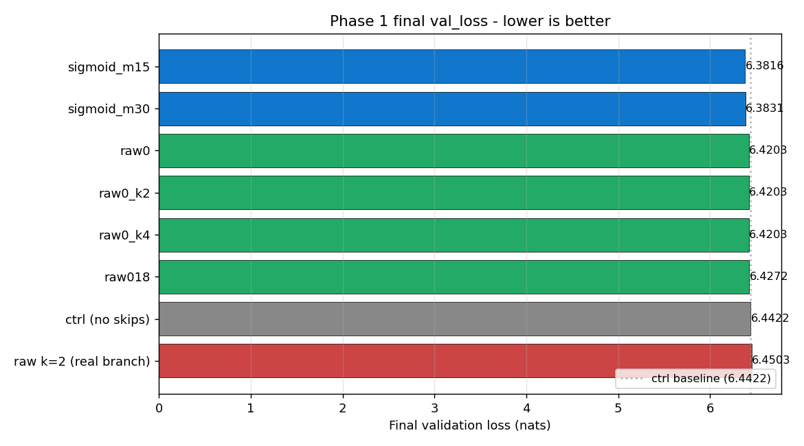

# Bridge Early Layers to Late Layers to Improve Your LLM Training: U-Net Skips

By Vuk Rosić

We added this trick to a small model and validation loss improved:



A U-Net skip connects an early transformer layer to a matching late one.

It is just a small learned bridge that the model can scale up or down.

The bridge starts almost off, so it never hurts the model at the start of training.

Late layers can reach back to the simple, local features the early layers saw, and gradients get a shorter path back to the start.


## How it works, step by step

A deep transformer processes tokens one layer at a time, and each layer only reads the layer right below it.

Early layers capture simple, local patterns.

By the late layers those early details can get washed out.

A U-Net skip saves each early layer's output and adds it back into a matching late layer - first to last, second to second-to-last, and so on.

```text
layer 0  ->  layer 7
layer 1  ->  layer 6
layer 2  ->  layer 5
layer 3  ->  layer 4
```

Each bridge is gated with a sigmoid, so the model decides how much to pull in.

The sigmoid keeps the gate in [0, 1] - stable to train.

The gate weight starts at -1.5, so `sigmoid(-1.5)` is about 0.18.

A small nonzero start matters: a gate at exactly zero gets almost no gradient and can fail to ever turn on.


## In code

Keep one gate vector per bridge, initialized to -1.5.

```python
# n_skips bridges, one gate value per embedding dimension
gate = nn.Parameter(torch.full((n_skips, d_model), -1.5))
# sigmoid(-1.5) ~ 0.18  ->  the skip starts small but nonzero
```

In the first half of the layers, save each layer's output.

```python
skips = []
for i, block in enumerate(blocks):
    x = block(x)
    if i < n_skips:
        skips.append(x)        # remember early outputs
```

In the second half, before each layer, add its matching early output through the sigmoid gate.

```python
for i, block in enumerate(blocks):
    if i >= n_layers - n_skips:
        j = n_layers - 1 - i               # matching early layer
        x = x + torch.sigmoid(gate[j]) * skips[j]
    x = block(x)
```

The first half writes its outputs, and the second half reads them back scaled by a learned per-dimension gate.

## Phase 1 ablation

Eight runs on a tiny ~1M-param model (12 layers, d_model 64), 733 steps (~3M tokens), all with seed 42.

The three "raw0" rows below are bit-identical runs - the skip-count flag was ignored, so all three used the default k=6.

| run | use_unet_skips | gate_type | gate_init | skip_count | val_loss | val_ppl |
|---|---|---|---|---|---|---|
| `tiny_unet_ctrl` | false | - | - | 0 | 6.4422 | 627.78 |
| `tiny_unet_raw0_k2_real` | true | raw | 0.0 | **2** | 6.4503 | 632.90 |
| `tiny_unet_raw0` | true | raw | 0.0 | 6 (default) | 6.4203 | 614.20 |
| `tiny_unet_raw018` | true | raw | 0.18 | 6 (default) | 6.4272 | 618.43 |
| `tiny_unet_sigmoid_m15` | true | sigmoid | -1.5 | 6 (default) | **6.3816** | **590.85** |
| `tiny_unet_sigmoid_m30` | true | sigmoid | -3.0 | 6 (default) | 6.3831 | 591.77 |



### Findings

The sigmoid bound beats raw scalar gates by 0.04-0.07 val_loss, and the bound - not the start point - is what helps: `sigmoid(-1.5)` and `raw_init=0.18` start with the same effective weight, but sigmoid ends 0.046 val_loss better because the [0, 1] bound keeps the gate from drifting to values that would dominate the residual stream.


Skip count is non-monotonic for raw gates. With k=2 (only the deepest two bridges) the model is *worse* than no skips, but k=6 (the full U) is *better* - it needs a minimum bridge count to overcome the dead-start of raw gates at 0.


### Caveats

The skip_count sweep is incomplete - only `raw0_k2_real` actually used a non-default skip count, so k=1, 3, 4, 5 are untested for both families. The `raw0_k2_real` run also used a different code path ("real" branch), so the k=2 dip may be a branch artifact, not a property of the architecture. All runs are tiny1m at 3M tokens; if the sigmoid-vs-raw gap holds or grows at 5-10M, the bound is doing real work.

### Want to go deeper in AI research? I'll coach you 1-on-1

Bring whatever you're stuck on - picking a direction, your first experiment, a paper you can't crack, your training setup, or a career move.

📆 **$20 (80% OFF) for the founding cohort - first 8 spots.** Not a fit? I'll
refund in the first 10 minutes, no hard feelings.
→ https://cal.com/vuk-ai/60-min

### Not ready for a call? Start free in the Skool

Every experiment I post comes with the scaffolded code and a step-by-step
protocol, so you can reproduce it yourself and then run your own variant. You also get the weekly research thread and a community of people doing real AI research.
Free to try.
→ https://www.skool.com/become-ai-researcher-2669/about
